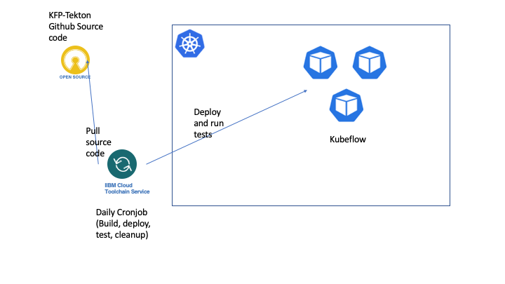

# IBM Cloud Toolchain for [kfp-tekton](https://github.com/kubeflow/kfp-tekton)

We use the "Develop a Kubernetes app" [toolchain](https://www.ibm.com/cloud/architecture/tutorials/use-develop-kubernetes-app-toolchain?task=2) to enable CI/CD testing for kfp-tekton.



The toolchain is bound to an IBM Cloud Kubernetes Service (IKS) cluster and runs the following pipeline:

1. Pull the latest commit
2. Run unit tests
3. Build docker images and push to IBM Cloud Registry
3. Deploy tekton and kfp-tekton to IKS
4. Run e2e tests (submit a pipeline, check endpoints, etc)
5. Remove tekton and kfp-tekton

### Custom Image
The [Dockerfile](./Dockerfile) is used as a `Custom Docker Image` to
run a pipeline job. It contains:
- Node.js
- Go
- kubectl
- kustomize
- helm2
- heml3
- jq
- ibmcloud

Run the following command to build the image:
```
docker build -t pipeline-base-image -f Dockerfile .
```

Or you can build and push the image to ibm cloud container registry:
```
ibmcloud cr build -f Dockerfile --tag <registry url>/<namespace>/pipeline-base-image:<image tag> .
```
Replase the `registry url`, `namespace`, `image tag` and even the `image name` as you want.

**Note:**
You can also use docker argument to specify the version of `Node.js`, `Go`,
`kubectl`, `heml2`, `heml3` and etc. Check the `ARG` in Dockerfile to see
the details.

### Scripts

When running jobs in a pipeline, you can `source` an external shell script. For example:
```
source <(curl -sSL "https://raw.githubusercontent.com/yhwang/kfp-tekton-toolchain/main/scripts/run-test.sh")
```

Here are two scripts under `scripts` directory:
- `run-test.sh`: it's used to run test cases in `kfp-tekton`
- `build-image.sh`: it cleans up kfp-tekton docker images in container registry and
  build the kfp-tekton docker images. The images we need include:
  - api-server
  - persistenceagent
  - metadata-writer
  - scheduledworkflow
  
  You need to specify the `DOCKER_FILE`, `DOCKER_ROOT`, `IMAGE_NAME` environment variables
  properly. For example, use `DOCKER_FILE=backend/Dockerfile` and `IMAGE_NAME=api-server`
  to build api-server image. It also needs some variables from `run-test.sh` script. The
  script only build one image according to the `DOCKER_FILE` and `IMAGE_NAME` you specify.
  In order to build all the images, you need to create multiple jobs and assign different
  values for those env vars.

These scripts store variables into ${ARCHIVE_DIR}/build.properties which could be used
by the subsequent jobs in the next stage. You need to specify `build.properties` as a
property file in the `Environment properties` tab.